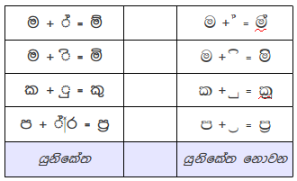
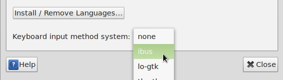
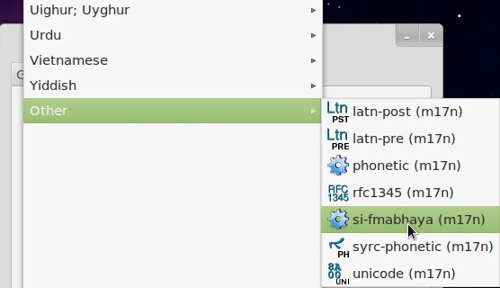
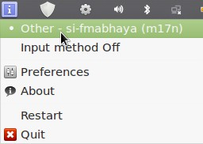

ලිනක්ස් මත යුනිකේත නොවන සිංහල අකුරු යතුරුලියනය කිරීම.
==

සිංහල යතුරු ලියනය කිරීමට (යුනිකේත නොවන) වින්ඩෝස් මත දී නම් පහසුකම් ඇත. ඒ සඳහා KeyMan නම් වානිජ මෘදුකාංගය බොහෝ පිරිස් අතර ජනප්‍රිය වී ඇත. නමුත් ලිනක්ස් මතදී සිංහල යතුරු ලියනය කිරීම සඳහා මේතාක්කල් පහසු ක්‍රමයක් නොතිබුණි. 

මෙය භාවිතා කිරීමට ප්‍රථමයෙන් ලිනක්ස් මත IBus ස්ථාපනය කොට ගත යුතුය.

### Step 1: Installing & Enabling Ibus
 1. අදාල පැකේජයන් ස්ථාපනය කර ගන්න: `sudo apt-get install ibus ibus-m17n m17n-db m17n-contrib ibus-gtk`
 2. ඉන්පසු System tools > System Settings > Language Support වෙත ගොස් Keyboard input method system ලෙස IBus තෝරන්න. (මෙම අවස්ථාවේ The language support is not installed completely ලෙස
කවුළුවක් විවෘත වුවහොත්  Remind me later ලෙස ලබා දෙන්න.)

     
### Step 2: යුනිකේත නොවන සිංහල යතුරු පුවරුව ස්ථාපනය සහ සක්‍රීය කිරීම
 1. `si-fmabhaya.mim` ගොනුව භාගත කරගන්න
 2. ඉන්පසු `File system>usr>share/m17n` වෙත ගොස් භාගත කරගත් ගොනුව Paste කර ගන්න.
 3. IBus හි preferences>input method>select an input method>other>si-fmabhaya වෙත ගොස් සිංහල යතුරු පුවරුව ්ාා කර ගන්න.  

 4. දැන් යතුරු ලියනයට සූදානම්. අයිකනය මත ක්ලික් කර අදාල යතුරු පුවරුව තෝරා යතුරු ලියනය අරඹන්න.
රූපයේ පරිදි IBus හි අයිකනය නිල් පැහැති වන අවස්ථාවේ යතුරු ලියන ආකාරය සක්‍රීය වී අතර යතුරු ලියනය කිරීමේදී සිංහල අකුරු ස්වයංක්‍රීයව නිවැරදි කෙf3⁄4. මෙම යතුරු පුවරුව විජයසේකර ක්‍රමයට සමානවන අතර සංඥක අක්ෂර පමණක් වෙනස් වේ. අදාල අකුරට පසු / යතුරු ලියනය කිරීමෙන් සංඥක අක්ෂර ලබා ගත හැකි වේ.

